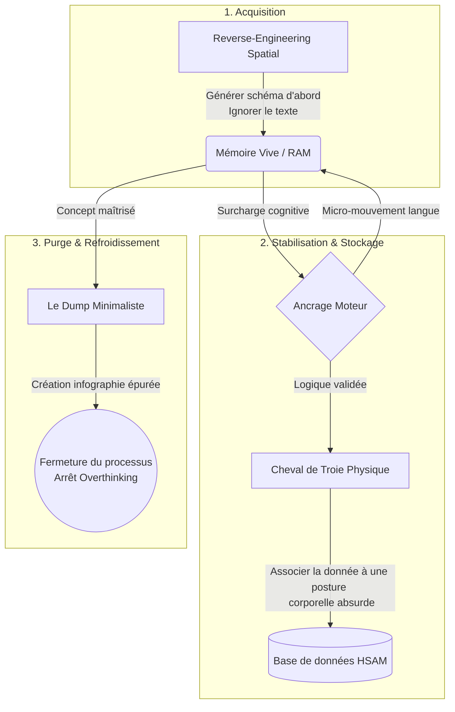

<!-- 
import { API } from "./api.js";

// --- 1. SÉLECTEURS DU DOM ---
const btnMenuMobile = document.getElementById("btn-menu-mobile");
const sidebar = document.querySelector(".sidebar");
const btn_add_cycle = document.getElementById("btn-add-cycle");
const panel_add_cycle = document.getElementById("panel-add-cycle");
const bg_add_cycle = document.getElementById("bg-add-cycle");
const btn_close_panel = document.getElementById("btn-close-panel");
const btn_cancel = document.getElementById("btn-cancel");
const submit = document.getElementById("form-add-cycle");
const tbody = document.querySelector(".list-cycles");

// Champs du formulaire
const nom = document.getElementById("nom");
const id_tontine = document.getElementById("id_tontine"); // Le <select>
const statut = document.getElementById("statut");
const id_beneficiaire = document.getElementById("id_beneficiaire"); // Le <select>
const group_beneficiaire = document.getElementById("group-beneficiaire"); // La div à cacher/montrer

// Éléments du panneau pour les titres
const panelTitle = document.querySelector('.panel-header h2');
const btnSubmitPanel = document.querySelector('#form-add-cycle button[type="submit"]');

// --- 2. VARIABLE MÉMOIRE ---
let idCycleAmodifier = null;

// --- 3. GESTION DE L'INTERFACE ---
btnMenuMobile.addEventListener("click", () => {
  sidebar.classList.toggle("active");
});

function toggle() {
  panel_add_cycle.classList.toggle("active");
  bg_add_cycle.classList.toggle("active");
}

btn_add_cycle.addEventListener("click", () => {
  idCycleAmodifier = null;
  nom.value = "";
  id_tontine.value = "";
  statut.value = "ouvert";
  id_beneficiaire.value = "";
  
  // On CACHE le bénéficiaire quand on crée un nouveau cycle
  group_beneficiaire.style.display = "none"; 

  panelTitle.textContent = "Nouveau Cycle";
  btnSubmitPanel.textContent = "Créer le cycle";
  toggle();
});

btn_cancel.addEventListener("click", toggle);
btn_close_panel.addEventListener("click", toggle);
bg_add_cycle.addEventListener("click", toggle);

// --- 4. CHARGEMENT DES MENUS DÉROULANTS (La Nouveauté !) ---
async function charger_selects() {
    try {
        // 1. On récupère les tontines pour remplir le premier <select>
        // (Assure-toi d'avoir une route GET /tontines dans ton backend !)
        const tontines = await API.get("/tontines");
        tontines.forEach(t => {
            id_tontine.innerHTML += `<option value="${t.id_tontine}">${t.nom}</option>`;
        });

        // 2. On récupère les membres pour remplir le select des bénéficiaires
        const membres = await API.get("/members");
        membres.forEach(m => {
            id_beneficiaire.innerHTML += `<option value="${m.user_id}">${m.nom}</option>`;
        });

    } catch (error) {
        console.error("Erreur lors du chargement des menus :", error);
    }
}

// --- 5. CHARGEMENT DU TABLEAU ---
async function charger_cycles() {
    try {
        const cyclesDb = await API.get("/cycles");
        tbody.innerHTML = ""; 

        cyclesDb.forEach((cycle) => {
            // Note : Pour l'instant on affiche les ID, 
            // l'idéal serait d'avoir les noms (on verra ça avec une jointure SQL plus tard)
            let ligne = `
                <tr>
                    <td>${cycle.id_cycle}</td> 
                    <td>${cycle.nom}</td>
                    <td>Tontine N°${cycle.id_tontine}</td>
                    <td>${cycle.id_beneficiaire ? 'Membre N°' + cycle.id_beneficiaire : 'En attente'}</td>
                    <td>${cycle.statut}</td>
                    <td>
                        <button class="btn-edit" data-id="${cycle.id_cycle}" data-nom="${cycle.nom}" data-tontine="${cycle.id_tontine}" data-statut="${cycle.statut}" data-beneficiaire="${cycle.id_beneficiaire}" style="background:none; border:none; cursor:pointer; font-size:20px; color: var(--color-primary); margin-right: 10px;"><i class='bx bx-edit-alt' style="pointer-events: none;"></i></button>
                        <button class="btn-delete" data-id="${cycle.id_cycle}" style="background:none; border:none; cursor:pointer; font-size:20px; color: #E74C3C;"><i class='bx bx-trash' style="pointer-events: none;"></i></button>
                    </td>
                </tr>
            `;
            tbody.innerHTML += ligne;
        });
    } catch (error) {
        console.error("Erreur de connexion au backend :", error);
    }
}

// INITIALISATION
charger_selects();
charger_cycles();

// --- 6. ÉCOUTEURS D'ACTION (À TOI DE JOUER !) ---
// -> Écris ici le tbody.addEventListener('click', ...) pour Supprimer et Modifier
// (N'oublie pas de faire group_beneficiaire.style.display = "block"; quand tu cliques sur "Modifier")

// --- 7. SOUMISSION DU FORM (À TOI DE JOUER !) ---
// -> Écris ici le submit.addEventListener("submit", ...) pour le POST et le PUT

// --- 6. ÉCOUTEUR GLOBAL POUR MODIFIER ET SUPPRIMER ---
tbody.addEventListener('click', async (event) => {
    
    // ACTION A : SUPPRIMER
    if (event.target.classList.contains('btn-delete')) {
        const id_cycle = event.target.dataset.id;
        
        if (confirm("Attention : Supprimer ce cycle effacera aussi toutes les cotisations liées. Continuer ?")) {
            try {
                await API.delete('/cycles/' + id_cycle);
                charger_cycles();
            } catch (error) {
                console.error("Erreur lors de la suppression :", error);
                alert("Impossible de supprimer le cycle.");
            }
        }
    }

    // ACTION B : MODIFIER
    if (event.target.classList.contains('btn-edit')) {
        // 1. Récupération des données depuis le bouton
        const id = event.target.dataset.id;
        const nomCycle = event.target.dataset.nom;
        const tontineId = event.target.dataset.tontine;
        const statutCycle = event.target.dataset.statut;
        const beneficiaireId = event.target.dataset.beneficiaire;

        // 2. Pré-remplissage du formulaire
        nom.value = nomCycle;
        id_tontine.value = tontineId;
        statut.value = statutCycle;
        
        // Gestion du bénéficiaire (s'il y en a un ou pas)
        if (beneficiaireId && beneficiaireId !== "null") {
            id_beneficiaire.value = beneficiaireId;
        } else {
            id_beneficiaire.value = "";
        }

        // 3. Mise en mémoire
        idCycleAmodifier = id;

        // 4. ON AFFICHE LE CHAMP BÉNÉFICIAIRE (La magie est ici)
        group_beneficiaire.style.display = "block";

        // 5. Changement de l'UI
        panelTitle.textContent = "Modifier le Cycle";
        btnSubmitPanel.textContent = "Enregistrer";

        toggle();
    }
});

// --- 7. SOUMISSION DU FORMULAIRE (POST OU PUT) ---
submit.addEventListener("submit", async (event) => {
    event.preventDefault();
    
    let nom_entre = nom.value.trim();
    let tontine_entre = id_tontine.value;
    let statut_entre = statut.value;
    let beneficiaire_entre = id_beneficiaire.value;
    
    if (nom_entre !== "" && tontine_entre !== "") {
        // On prépare l'objet (si pas de bénéficiaire, on n'envoie pas l'info pour ne pas écraser la BDD)
        let cycle_data = {
            nom: nom_entre,
            id_tontine: tontine_entre,
            statut: statut_entre
        };
        
        // On n'ajoute le bénéficiaire que s'il a été sélectionné
        if (beneficiaire_entre !== "") {
            cycle_data.id_beneficiaire = beneficiaire_entre;
        }

        try {
            if (idCycleAmodifier !== null) {
                // MODIFICATION
                await API.put("/cycles/" + idCycleAmodifier, cycle_data);
            } else {
                // CRÉATION
                await API.post("/cycles", cycle_data);
            }

            // --- Nettoyage après succès ---
            nom.value = "";
            id_tontine.value = "";
            statut.value = "ouvert";
            id_beneficiaire.value = "";
            idCycleAmodifier = null;
            
            // On recache le bénéficiaire pour la prochaine création
            group_beneficiaire.style.display = "none";
            
            panelTitle.textContent = "Nouveau Cycle";
            btnSubmitPanel.textContent = "Créer le cycle";
            
            toggle();
            charger_cycles(); 
            
        } catch (error) {
            console.error("Erreur serveur :", error);
            // Si ton backend renvoie une erreur (ex: "tout le monde n'a pas payé"), elle sortira ici
            alert("Erreur : Vérifie que le membre existe et que toutes les conditions sont remplies.");
        }
    } else {
        alert("Veuillez remplir le nom et choisir une tontine.");
    }
});

 -->